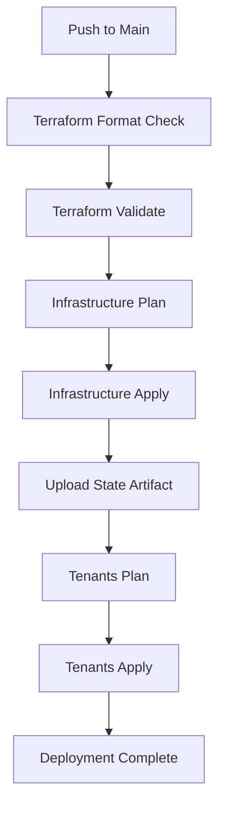

# GitHub Actions CI/CD Setup

This repository includes a complete GitHub Actions workflow for automated Terraform deployment.

## 🚀 Workflow Overview

The CI/CD pipeline automatically handles:

1. **Infrastructure Phase**: Deploy core AWS resources (VPC, EKS, IAM)
2. **Tenants Phase**: Deploy multi-tenant configuration  
3. **Validation**: Format checking, validation, and planning
4. **State Management**: Automatic state sharing between phases

## 📋 Setup Instructions

### 1. Repository Secrets Configuration

Go to your GitHub repository → Settings → Secrets and variables → Actions

Add the following secrets:

```
AWS_ACCESS_KEY_ID=AKIA...
AWS_SECRET_ACCESS_KEY=your-secret-key
```

### 2. Workflow Triggers

**Automatic Deployment:**
- Any push to `main` branch triggers full deployment
- Pull requests run plan and validation only

**Manual Deployment:**
- Go to Actions tab → "Terraform CI/CD" → "Run workflow"
- Choose action: `plan`, `apply`, or `destroy`

### 3. Deployment Process



### 4. Monitoring Deployment

- **Real-time Progress**: View in GitHub Actions tab
- **Detailed Logs**: Each step shows terraform output
- **Artifacts**: State files uploaded for debugging
- **Status Badges**: Add to README for visibility

## 🛡️ Security Best Practices

- **Secrets Management**: AWS credentials stored as GitHub secrets
- **State Security**: Terraform state handled via artifacts (consider remote backend for production)
- **Branch Protection**: Require PR reviews for main branch
- **Environment Protection**: Use GitHub environments for production deployments

## 🔧 Customization

### Modify Workflow

Edit `.github/workflows/terraform.yml` to:
- Change Terraform version
- Add additional validation steps
- Modify deployment conditions
- Add notifications (Slack, email)

### Environment Variables

Add to workflow file:
```yaml
env:
  TF_VAR_cluster_name: ${{ vars.CLUSTER_NAME }}
  TF_VAR_environment: ${{ vars.ENVIRONMENT }}
```

### Remote State Backend

For production, configure remote state in `backend.tf`:
```hcl
terraform {
  backend "s3" {
    bucket = "your-terraform-state-bucket"
    key    = "infrastructure/terraform.tfstate"
    region = "us-west-2"
  }
}
```

## 📊 Workflow Status

Add this badge to your README.md:

```markdown
[](https://github.com/YOUR_USERNAME/YOUR_REPO/actions/workflows/terraform.yml)
```

## 🚨 Troubleshooting

### Common Issues

1. **AWS Credentials Error**
   - Verify secrets are correctly set
   - Check IAM permissions

2. **State Lock Issues**  
   - Use remote state backend for production
   - Clear locks manually if needed

3. **Resource Conflicts**
   - Ensure unique resource names
   - Check for existing resources in AWS

4. **Terraform Version Conflicts**
   - Pin Terraform version in workflow
   - Update local version to match

### Debug Steps

1. Check workflow logs in Actions tab
2. Download state artifacts for inspection  
3. Run terraform commands locally to reproduce
4. Enable Terraform debug logging: `TF_LOG=DEBUG`

## 📈 Next Steps

1. **Production Setup**: Configure remote state backend
2. **Notifications**: Add Slack/email notifications
3. **Testing**: Add terraform validate and security scanning
4. **Environments**: Set up dev/staging/prod workflows
5. **Rollback**: Implement automated rollback on failure